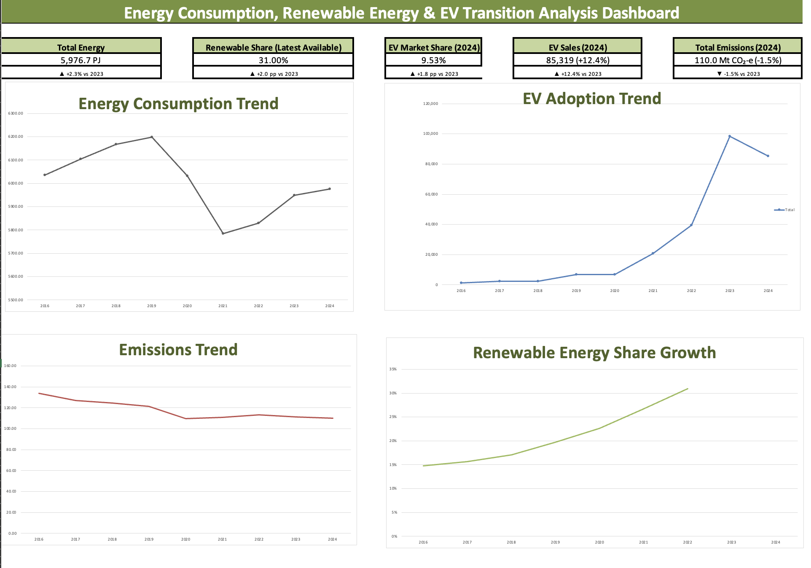

# Energy Consumption, Renewable Energy & EV Transition Analysis

## Project Overview

This research and analytics project examines Australia's transition towards a lower-carbon economy between 2016 and 2024.

The analysis combines:

- National energy consumption data
- Renewable energy generation trends
- Electric vehicle adoption trends
- Greenhouse gas emissions data

The objective is to identify evidence of Australia's energy transition through data-driven analysis and dashboard reporting.

---

## Research Questions

1. How has Australian energy consumption changed over time?
2. How has renewable energy adoption changed?
3. How quickly are EVs being adopted?
4. What relationship exists between EV growth and emissions trends?
5. What evidence exists of Australia's transition towards a lower-carbon economy?

---

## Tools Used

- Microsoft Excel
- Pivot Tables
- Pivot Charts
- KPI Reporting
- Data Cleaning & Validation
- Dashboard Design

---

## Dashboard Preview

---

## Key Findings

### Energy Consumption
Australian energy consumption remained relatively stable over the study period, peaking at 6,199 PJ in 2019 before declining to 5,977 PJ in 2024.

### Renewable Energy
Renewable energy generation increased substantially, with renewable share rising from approximately 15% in 2016 to over 30% by 2022.

### EV Adoption
EV adoption experienced rapid growth, with annual sales increasing from 1,369 vehicles in 2016 to 98,436 vehicles in 2023.

### Emissions Trends
Greenhouse gas emissions generally declined while EV adoption accelerated.

### Sustainability Transition
Increasing renewable generation, strong EV market growth and declining emissions collectively indicate Australia's ongoing transition towards a lower-carbon economy.

---

## Project Structure

- Dashboard
- Research Questions & Answers
- Data Quality Checks
- Master Dataset
- Pivot Tables
- Insights & Recommendations

---

## Data Sources

- Australian Energy Statistics (DCCEEW)
- Electric Vehicle Council Australia
- National Greenhouse Gas Inventory

---

## Files Included

- Excel Dashboard Workbook (.xlsx)
- Dashboard Screenshots
- Data Source Documentation
